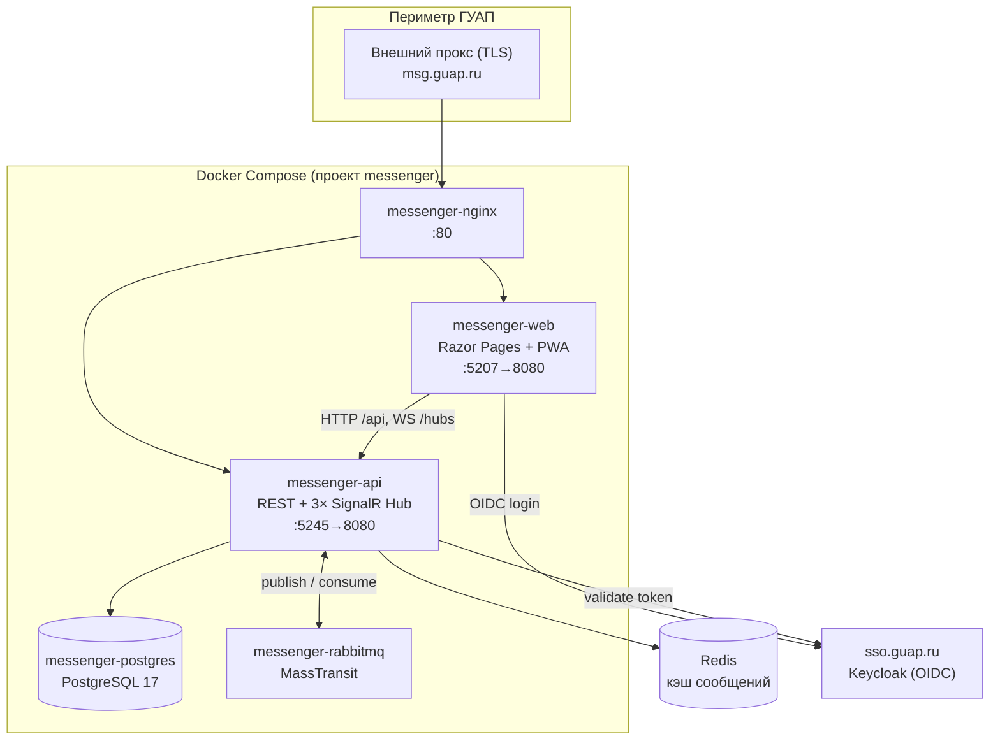

# GUAP Messenger

Корпоративный мессенджер ГУАП: личные и групповые чаты, реакции, вложения, рассылки,
web-push и статусы присутствия в реальном времени. Авторизация — через единую учётную
запись ГУАП (Keycloak OIDC). Актуально на 2026-10-02, целевой фреймворк **.NET 10**.

---

## 1. Обзор

Система состоит из двух ASP.NET Core приложений и трёх хранилищ, разворачивается через
Docker Compose за реверс-прокси.

- **Messenger.API** — ядро: REST API (версионированный, `api/v1/...`) + три SignalR-хаба
  для real-time (сообщения, статусы, уведомления). Сообщения шифруются в покое (AES-GCM).
- **Messenger.Web** — фронтенд на Razor Pages с поддержкой PWA (offline-first, IndexedDB).
- Межсервисная асинхронность — через **RabbitMQ / MassTransit**: отправленное сообщение
  публикуется в шину, консьюмер рассыпает его подключённым клиентам по SignalR.

Архитектурный паттерн — слоистая Clean Architecture:
`API` (контроллеры, хабы) → `Infrastructure` (сервисы, EF, кэш, шина) → `Core`
(доменные модели, DTO, контракты). Веб-клиент ходит в API по HTTP и WebSocket.

---

## 2. Архитектура



**Границы и потоки:**

- Входящий трафик всегда через внешний прокс → `messenger-nginx` → `web`/`api`.
  Приложения доверяют заголовкам `X-Forwarded-*` (см. §7).
- **Синхронный путь:** веб-клиент → `POST /api/v1/messages/{chatId}` → запись в Postgres.
- **Real-time путь:** API публикует событие в RabbitMQ → `ChatMessageSentConsumer`
  доставляет его через `ChatHub` всем участникам чата по WebSocket.
- **Кэш:** горячие страницы сообщений и вложений кэшируются в Redis (`RedisCacheService`).
- **Шифрование:** тела сообщений шифруются `AesGcmEncryptionService` мастер-ключом
  (`Encryption:MasterKeyBase64`) перед записью в БД.

### Основные доменные модели (`Messenger.Core/Models`)

`User`, `Role`, `Chat`, `ChatParticipant`, `Message`, `MessageDeliveryStatus`, `Reaction`,
`Attachment`, `Notification`, `PushSubscription`, `Broadcast`, `BroadcastRecipient`,
`UserStatus`, `AccountSetting`, `Login`, `Blacklist`.

---

## 3. Требования к окружению

| Компонент | Версия | Назначение |
|---|---|---|
| Docker + Compose plugin | 24+ / v2 | сборка и запуск |
| .NET SDK | **10.0** | сборка образов (`Dockerfile.api/web`) |
| ASP.NET Runtime | **10.0** | рантайм контейнеров |
| PostgreSQL | 17 | основное хранилище (контейнер) |
| RabbitMQ | 3-management | шина (контейнер) |
| Redis | — | кэш (внешний/отдельный) |
| Keycloak (OIDC) | — | `sso.guap.ru/realms/master`, client `messager` |

> [!IMPORTANT]
> Версия образов в `Dockerfile.api` / `Dockerfile.web` (`sdk:X.0`, `aspnet:X.0`) должна
> совпадать с `<TargetFramework>` в `.csproj`. Рассинхрон даёт `NETSDK1045` на сборке.

---

## 4. Быстрый старт (локально)

```bash
# 1. Клонировать (SSH на gl.guap.ru закрыт — только HTTPS+PAT)
git clone https://gl.guap.ru/guap-projects/guap-messenger.git
cd guap-messenger

# 2. Создать .env из шаблона и заполнить значения
cp .env.example .env
#   минимально задать: POSTGRES_PASSWORD, RABBITMQ_PASSWORD,
#   AzureAd__ClientSecret, Encryption__MasterKeyBase64, Vapid__*

# 3. Поднять весь стек (имя проекта фиксируем — см. §7)
COMPOSE_PROJECT_NAME=messenger docker compose up -d --build

# 4. Проверить
docker compose ps
curl -s localhost/health            # health-эндпоинт API через nginx
```

Открыть веб-клиент: `http://localhost` (локально) или домен за проксей.
Интерактивная документация API (Scalar) доступна только в Development:
API поднимает её на своём порту при `ASPNETCORE_ENVIRONMENT=Development`.

Генерация обязательных ключей:

```bash
# AES master key (base64, 32 байта)
openssl rand -base64 32

# VAPID (web-push) — любым генератором web-push, например:
npx web-push generate-vapid-keys
```

---

## 5. Матрица конфигурации

Все значения читаются из окружения (в проде — из CI-переменной `ENV_FILE`, которая
копируется в `.env`). Двойное подчёркивание = вложенность секции (`AzureAd__ClientId`
→ `AzureAd:ClientId`).

| Переменная | Тип | Default | Назначение / безопасность |
|---|---|---|---|
| `POSTGRES_DB` | string | `GUAP_Messenger` | имя БД |
| `POSTGRES_USER` | string | `postgres` | пользователь БД |
| `POSTGRES_PASSWORD` | secret | — | **секрет**, обязателен |
| `RABBITMQ_USER` | string | `messenger` | пользователь шины |
| `RABBITMQ_PASSWORD` | secret | — | **секрет**, обязателен |
| `ConnectionStrings__DefaultConnection` | string | собирается в compose | строка подключения EF (из `POSTGRES_*`) |
| `URL__API__HTTPS` | url | — | публичный адрес API (`https://msg.guap.ru`) |
| `URL__Web__HTTPS` | url | — | публичный адрес веба; источник CORS-политики `AllowWebApp` |
| `URL__API__Version` | string | `1.0` | версия в путях `api/v{N}/...` и маршрутах хабов |
| `AzureAd__Instance` | url | — | база Keycloak: `https://sso.guap.ru/realms` |
| `AzureAd__TenantId` | string | — | realm: `master` |
| `AzureAd__ClientId` | string | `messager` | OIDC client id |
| `AzureAd__ClientSecret` | secret | — | **секрет** OIDC client |
| `AzureAd__CallbackPath` | path | `/signin-oidc` | redirect после входа |
| `AzureAd__SignedOutCallbackPath` | path | `/signout-callback-oidc` | redirect после выхода |
| `Encryption__MasterKeyBase64` | secret | — | **секрет**: AES-GCM мастер-ключ (base64, 32Б) |
| `Vapid__Subject` | string | `mailto:admin@guap.ru` | контакт для web-push |
| `Vapid__PublicKey` | string | — | публичный VAPID-ключ |
| `Vapid__PrivateKey` | secret | — | **секрет** VAPID |

> [!NOTE]
> `AzureAd__Instance` + `AzureAd__TenantId` обязательны: Authority собирается как
> `{Instance}/{TenantId}` → `https://sso.guap.ru/realms/master`. Если их нет, приложение
> падает на старте запроса: `Authority must use HTTPS`.

---

## 6. Справочник API

Базовый префикс — `api/v1` (версия из `URL:API:Version`). Авторизация — Bearer JWT.
Для WebSocket токен можно передать query-параметром `?access_token=...` (middleware
пробрасывает его в заголовок `Authorization`).

### REST-эндпоинты (основные)

| Контроллер | Метод и путь | Назначение |
|---|---|---|
| **Chats** | `GET /chats` · `GET /chats/{chatId}` | список / один чат |
| | `POST /chats/create-chat` · `PUT /chats/{chatId}` · `DELETE /chats/{chatId}` | CRUD чата |
| | `POST /chats/{chatId}/{userId}/participant` · `DELETE /chats/{chatId}/{userId}` | участники |
| **Messages** | `POST /messages/{chatId}` · `GET /messages/{chatId}` | отправка / история |
| | `PUT /messages/{messageId}` · `DELETE /messages/{messageId}` · `POST /messages/bulk-delete` | правка / удаление |
| | `POST /messages/forward` · `GET /messages/{chatId}/search` · `GET /messages/{chatId}/export` | пересылка / поиск / экспорт |
| | `POST /messages/{chatId}/read` | отметка прочтения |
| **Reactions** | `GET/POST/DELETE /reactions/{messageId}` | реакции на сообщение |
| **Attachments** | `GET/POST /attachments/{messageId}` | вложения |
| **Broadcasts** | `POST /broadcasts/create` · `GET /broadcasts/my` · `GET /broadcasts/{id}` · `POST /broadcasts/{id}/read` | рассылки |
| **Push** | `POST /push/subscribe` · `DELETE /push/unsubscribe` · `POST /push/send` · `GET /push/vapid-public-key` | web-push |
| | `GET/POST /push/settings` · `POST /push/{notificationId}/read` | настройки / прочтение |
| **Users** | `GET /users` · `GET /users/search` · `GET /users/info` · `GET /users/{externalId}` | пользователи |
| | `PUT /users/update-profile` · `POST /users/upload-avatar` · `DELETE /users/delete-avatar` | профиль / аватар |
| | `GET /users/roles` · `POST /users/assign-role/{roleId}` | роли |
| **UserStatuses** | `GET /userstatuses` · `PUT /userstatuses` | статус присутствия |
| **Notifications** | `GET/POST /notifications` | уведомления |
| **Logins** | `GET/POST/PATCH /logins` | сессии/логины |
| **Authorization** | `POST /authorization/external/callback` | колбэк внешнего OIDC |
| **OAuthProxy** | `POST /oauth/token` | прокси выдачи токена |

### SignalR-хабы (WebSocket)

| Хаб | Путь | Что доставляет |
|---|---|---|
| `ChatHub` | `/api/v1/hubs/chat` | новые сообщения, реакции, статусы доставки |
| `UserStatusHub` | `/api/v1/hubs/userstatus` | онлайн/оффлайн присутствие |
| `NotificationHub` | `/api/v1/hubs/notification` | пуши и системные уведомления |

### Пример: отправка сообщения

```http
POST /api/v1/messages/9f3c.../  HTTP/1.1
Authorization: Bearer <jwt>
Content-Type: application/json

{ "content": "Привет", "attachmentIds": [], "replyToMessageId": null }
```

Путь выполнения: контроллер валидирует запрос → `MessageService` шифрует тело
(AES-GCM) и пишет в Postgres → публикует событие в RabbitMQ → `ChatMessageSentConsumer`
доставляет `MessageDto` участникам через `ChatHub`. Ошибки валидации — `400` с описанием
поля, отсутствие прав в чате — `403`, несуществующий чат — `404`.

### Пример: подключение к real-time

```js
const conn = new signalR.HubConnectionBuilder()
  .withUrl("/api/v1/hubs/chat", { accessTokenFactory: () => jwt })
  .withAutomaticReconnect()
  .build();
conn.on("MessageReceived", (msg) => { /* отрисовать */ });
await conn.start();
```

---

## 7. Прод: деплой, прокси, масштабирование

### CI/CD (gl.guap.ru)

Авто-деплой на push в `main`. `.gitlab-ci.yml` — один job `deploy` (тег раннера `msg`,
executor shell на самом сервере):

```yaml
deploy:
  stage: deploy
  tags: ["msg"]
  variables:
    COMPOSE_PROJECT_NAME: messenger
  script:
    - cp "$ENV_FILE" .env
    - docker compose build web api
    - docker compose up -d web api
  only: [main]
```

Секреты и настройки — в CI-переменной `ENV_FILE` (protected, File); в репозитории `.env`
не хранится. Деплой пересобирает только `web`/`api`; `postgres`/`rabbitmq`/`nginx`
не трогаются.

> [!IMPORTANT]
> `COMPOSE_PROJECT_NAME=messenger` обязателен и в CI, и при ручном запуске. Иначе Compose
> создаёт новый том и **теряется база** (`messenger_pg_data`). Явные `container_name` в
> compose обеспечивают, что пересоздаются именно живые контейнеры.

### Прокси и заголовки

Внешний прокс терминирует TLS и проксирует на внутренний `messenger-nginx`. Приложения
читают реальную схему/хост из `X-Forwarded-*`:

- в коде — `UseForwardedHeaders` с `KnownNetworks.Clear()` + `KnownProxies.Clear()`
  (прокси в соседнем контейнере, не loopback);
- в `nginx.conf` — `X-Forwarded-Proto https`.

Без этого ломается OIDC-колбэк (`message.State is null`). Большая auth-кука
(`SaveTokens=true`) требует увеличенных буферов на обоих nginx:
`proxy_buffer_size 16k; proxy_buffers 8 16k; large_client_header_buffers 8 32k;`
— иначе `502/400` на `/signin-oidc`.

### Поведение под нагрузкой

- **Кэш:** частые чтения (страницы сообщений, вложения) идут через Redis
  (`RedisCacheService`), снимая нагрузку с Postgres.
- **Rate limiting:** на API включён лимитер (`UseRateLimiter`, политика `api` на всех
  контроллерах) — защита от всплесков.
- **Real-time через шину:** доставка сообщений развязана через RabbitMQ, что позволяет
  горизонтально масштабировать API-инстансы (consumer’ы разбирают очередь), при условии
  общего Redis-backplane для SignalR.
- **Фоновые задачи:** `SessionCleanupBackgroundService` периодически чистит истёкшие
  сессии.

### Обслуживание

```bash
docker compose ps
docker compose logs -f api web
docker compose restart nginx        # после правки nginx.conf (bind-mount)
```

> [!NOTE]
> При рефакторинге не удалять из репозитория деплой-обвязку
> (`.gitlab-ci.yml`, `docker-compose.yml`, `Dockerfile.api/web`, `nginx.conf`,
> `.env.example`) и добавлять ключ в `ENV_FILE` при появлении нового `configuration[...]`
> в коде.
